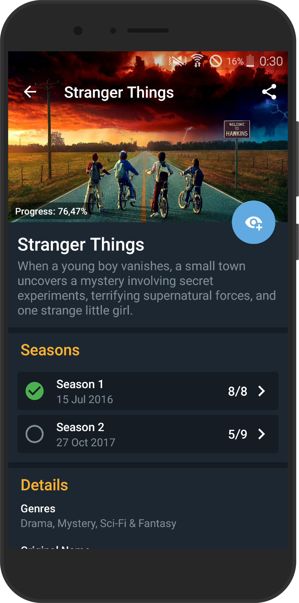
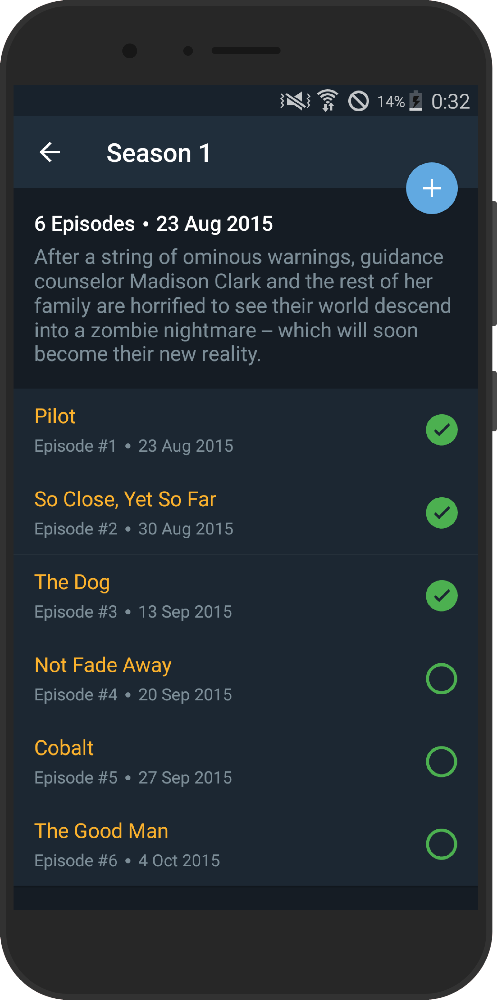

[apk]:        https://github.com/michaelbel/youshows/blob/master/app/release/shows-v1.0.2.apk
[tmdb]:       https://developers.themoviedb.org/3/getting-started/introduction
[paypal]:     https://paypal.me/michaelbel
[github]:     https://github.com/michaelbel/youshows
[licence]:    http://www.apache.org/licenses/LICENSE-2.0
[cangelog]:   https://github.com/michaelbel/YouShows/blob/master/CHANGELOG.md
[googleplay]: https://play.google.com/store/apps/details?id=org.michaelbel.shows

[minsdk-badge]:     https://img.shields.io/badge/minSdkVersion-21-0097A7.svg
[paypal-badge]:     https://img.shields.io/badge/Donate-Paypal-0097A7.svg
[license-badge]:    https://img.shields.io/badge/License-Apache_v2.0-0097A7.svg
[platform-badge]:   https://img.shields.io/badge/Platform-Android-0097A7.svg
[googleplay-badge]: https://img.shields.io/badge/Google_Play-Demo-0097A7.svg

<!---------------------------------------------------------------------------------------------------->

YouShows
======

[![platform-badge]][github]
[![minsdk-badge]][github]
[![license-badge]][licence]
[![googleplay-badge]][googleplay]
[![paypal-badge]][paypal]

Simple app to track and save your TV shows.
   

## Demo

## Screenshots

    
    
    
    
    
    
    
    
    

## Build
Take a look at `local.properties` and fill it with [your own][tmdb] `tmdb_api_key`.

## Changelog
Cangelog is available [here][cangelog].

## Open-source libraries
* [**Realm**](https://github.com/realm/realm-java) database
* [**Picasso**](https://github.com/square/picasso) for image loading
* [**Retrofit**](https://github.com/square/retrofit) for REST API communication
* [**RxJava2**](https://github.com/ReactiveX/RxJava) for Retrofit & background threads
* [**Gson**](https://github.com/google/gson) to convert Java Objects into JSON and back
* [**BottomSheet**](https://github.com/michaelbel/bottomsheet) for bottom dialogs
* [**ExpandableTextView**](https://github.com/Blogcat/Android-ExpandableTextView) for expnad/collapse text
* [**CircleProgressView**](https://github.com/jakob-grabner/Circle-Progress-View) for progress view

## License

    Copyright 2017 Michael Bely

    Licensed under the Apache License, Version 2.0 (the "License");
    you may not use this file except in compliance with the License.
    You may obtain a copy of the License at

       http://www.apache.org/licenses/LICENSE-2.0

    Unless required by applicable law or agreed to in writing, software
    distributed under the License is distributed on an "AS IS" BASIS,
    WITHOUT WARRANTIES OR CONDITIONS OF ANY KIND, either express or implied.
    See the License for the specific language governing permissions and
    limitations under the License.
